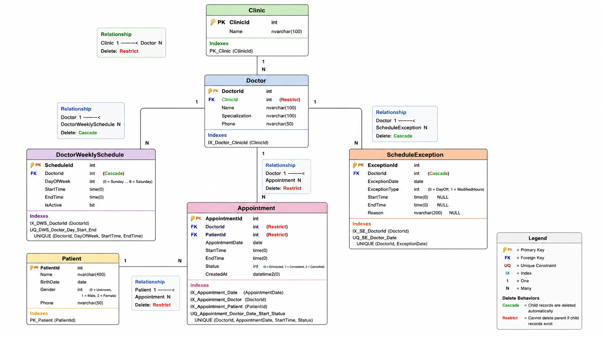
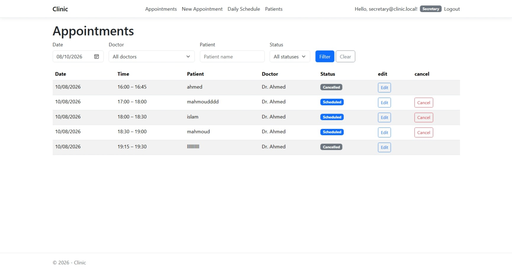
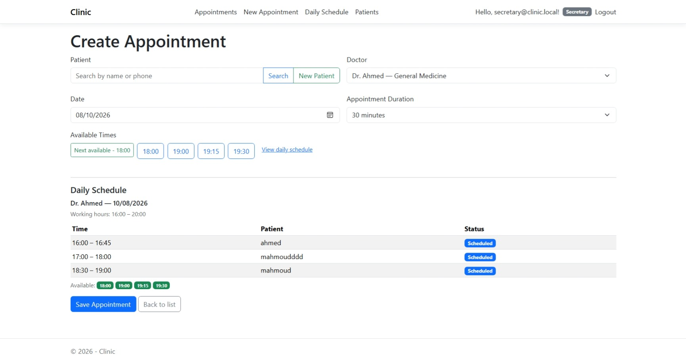
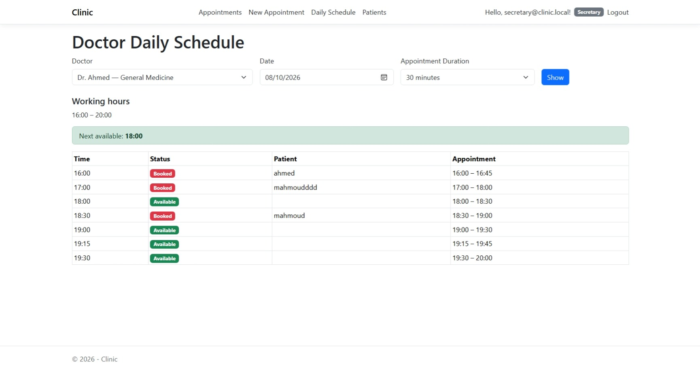
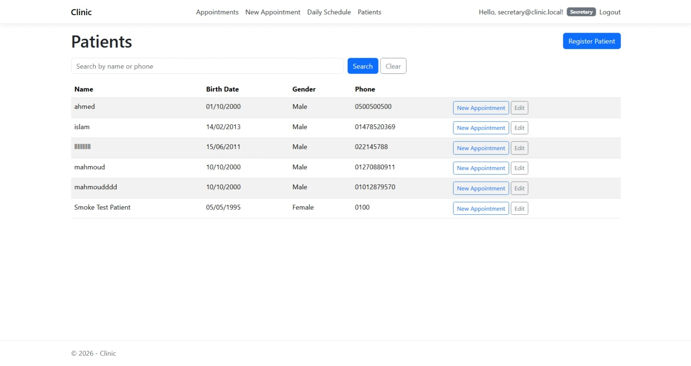
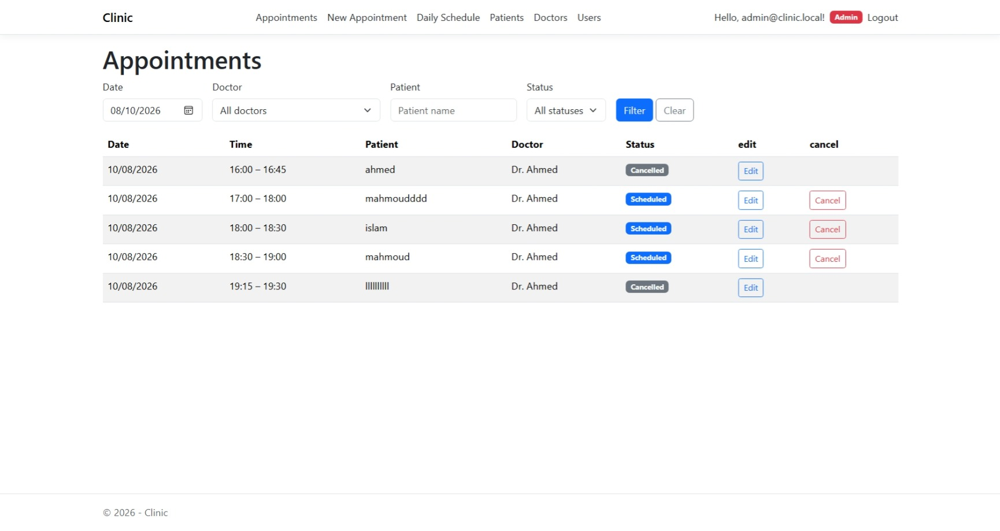

# Clinic Appointments Management

An ASP.NET Core MVC clinic Appointments management application for scheduling patient appointments. Secretaries manage appointments and patients; admins manage doctors, doctor schedules, and users. Available appointment slots are **calculated** on the fly from each doctor's weekly schedule and schedule exceptions — nothing is stored.

## Quick Start

```powershell
dotnet restore
dotnet build Clinic/Clinic.csproj
dotnet ef database update --project Clinic
dotnet run --project Clinic
```

Open `http://localhost:5295`, log in with one of the demo accounts below, and start booking appointments.

## The main role: Secretary

The application is designed around the secretary's daily workflow. A secretary can:

- **Create appointments** — search or register a patient, pick a doctor, date, and duration (15 / 30 / 45 / 60 minutes). Available times are computed dynamically from the doctor's effective schedule minus existing appointments, so a secretary only sees real open slots.
- **View all appointments** — paged list with status (Scheduled / Completed / Cancelled), filtering and pagination.
- **Edit or cancel appointments** — with server-side revalidation of availability.
- **Manage patients** — add, edit, view, and search a paged patient list (name, birth date, gender, phone).
- **View the daily schedule** — pick a doctor + date + duration filter and see the full day as a single table of booked and available rows, including in-page and inline previews on the booking form.

## Doctor schedule management (Admin only)

Doctor schedule management is a **separate, Admin-only workflow**, not part of the secretary's flow:

- Manage doctors (create, edit, details, delete-aware CRUD).
- Define **recurring weekly schedules** — one or more periods per day of the week, each with start/end times and an active flag. Exact duplicate periods per doctor/day are prevented by a unique constraint.
- Define **one-off schedule exceptions** per doctor per date:
  - **Day off** — the doctor has no working period that date.
  - **Modified hours** — overrides the weekly schedule for that date only; exceptions never modify the weekly schedule.
- Manage users — admins can create additional Admin/Secretary users (seeded demo users, plus any added through the UI).

## Key Features

### Authentication & Authorization

- ASP.NET Core Identity with cookie authentication.
- Exactly two roles: **Admin** and **Secretary**.
- `[Authorize]` attributes are the security boundary:
  - `Account` — public (login / logout / access denied).
  - `Appointments`, `Patients` — Admin + Secretary.
  - `Doctors`, weekly schedules, exceptions, users — Admin only.
- Roles and demo users are seeded idempotently at startup; credentials come from the `Seed` configuration section.

### Appointment Scheduling

- Slots are **calculated, never stored** — there is no `AvailableSlot`/`AppointmentSlot` table.
- Effective working periods = active weekly schedule rows, overridden by `ModifiedHours` or removed by `DayOff` exceptions.
- Slots step across the effective periods by the selected duration (15/30/45/60, 30 default), aligned to a 15-minute grid.
- Overlap rule: `existing.StartTime < new.EndTime && existing.EndTime > new.StartTime`.
- **Double-booking protection** — availability is revalidated server-side on every create/edit; the overlap check runs inside a `Serializable` transaction, backed by a unique index on `(DoctorId, AppointmentDate, StartTime, Status)` as a secondary guard. A conflict surfaces as a friendly "slot no longer available" message.
- `EndTime` is always server-calculated; client-supplied end times are never trusted.

### Patient Management

- Patient records hold name, birth date, gender, and phone; no patient data is denormalized onto appointments (foreign keys only).

### Daily Schedule

- Standalone daily-schedule page plus an inline AJAX preview on the booking form showing the full day (booked + available rows) for the selected doctor and duration.

### Pagination

- Server-side pagination (page size 10) on appointment, patient, doctor, and user grids, preserving filters across pages.

## Architecture

Pragmatic layered MVC — no CQRS, MediatR, Clean Architecture, AutoMapper, generic repositories, or Unit-of-Work abstraction.

```text
Browser
   ↓
MVC Controller        (HTTP concerns + orchestration only)
   ↓
Service Layer         (business rules)
   ↓
EF Core / DbContext
   ↓
SQL Server
```

- **Controllers are thin.** They handle HTTP concerns and orchestration only.
- **Business logic lives in services** (`Clinic/Services`), with interfaces next to implementations.
- **Scheduling is centralized** in `ScheduleService` + the pure `ScheduleCalculator` (effective working periods, slot stepping, overlap checks).
- **EF Core entities are never bound directly to form models** — ViewModels/DTOs are used for input/output.
- **Database access is EF Core only** (`ClinicDbContext`, `DbSet<T>`, async everywhere).

## Technology Stack

| Layer        | Technology                                          |
|--------------|-----------------------------------------------------|
| Framework    | ASP.NET Core MVC (net10.0, nullable + implicit usings) |
| Language     | C#                                                  |
| Data access  | Entity Framework Core 10 (SQL Server provider)      |
| Database     | SQL Server / SQL Server LocalDB                     |
| Identity     | ASP.NET Core Identity (EF Core stores, cookie auth) |
| UI           | Razor Views, Bootstrap 5, jQuery + jQuery Validation |
| Tests        | xUnit, SQLite in-memory provider                    |

## Database Design

Schema is configured in `ClinicDbContext` via the EF Core Fluent API and created by committed migrations.

```text
Clinic
  │
  │ 1:N  (Restrict)
  ▼
Doctor
  │
  ├────────────── 1:N (Cascade) ──── DoctorWeeklySchedule
  ├────────────── 1:N (Cascade) ──── ScheduleException
  │
  └────────────── 1:N (Restrict) ──── Appointment
                                        │
                                        │ N:1 (Restrict)
                                        ▼
                                     Patient
```

Key constraints and indexes:

| Entity                   | Constraints / indexes                                                                                                |
|--------------------------|-----------------------------------------------------------------------------------------------------------------------|
| `Clinic`                 | `Name` required, max 100.                                                                                             |
| `Doctor`                 | `Name`, `Specialization`, `Phone` required. FK `ClinicId` → `Clinic` with **Restrict**.                               |
| `DoctorWeeklySchedule`   | FK `DoctorId` → `Doctor` with **Cascade**. **Unique** `(DoctorId, DayOfWeek, StartTime, EndTime)`; index on `DoctorId`. |
| `ScheduleException`      | FK `DoctorId` → `Doctor` with **Cascade**. **Unique** `(DoctorId, ExceptionDate)` — one exception per doctor per date. |
| `Patient`                | `Name`, `Phone` required. `Gender` enum (Male/Female).                                                                 |
| `Appointment`            | FKs `DoctorId`, `PatientId` → **Restrict**. Indexes on `AppointmentDate`, `DoctorId`, `PatientId`. **Unique** `(DoctorId, AppointmentDate, StartTime, Status)` as a double-booking backstop. |
| Identity tables          | Standard `AspNetUsers`, `AspNetRoles`, `AspNetUserRoles`, etc.                                                        |

ERD:



## Screenshots

| | |
|---|---|
| Appointments list |  |
| New appointment (inline daily schedule) |  |
| Daily schedule |  |
| Patients |  |
| Admin (users) |  |

## Project Structure

```text
Clinic.slnx                         XML solution (Clinic + Clinic.Tests)
Clinic/
  Controllers/                      Account, Appointment, Patient, Doctor, User, Home
  Data/                             ClinicDbContext, DbSeeder, ClinicDbContextFactory, Migrations/
  Models/
    Entities/                       Clinic, Doctor, DoctorWeeklySchedule, ScheduleException, Patient, Appointment
    Enums/                          AppointmentStatus, Gender, ScheduleExceptionType
    Dtos/                           Input/output DTOs
  Security/                         ApplicationRoles
  Services/                         ScheduleCalculator, ScheduleService, AppointmentService, PatientService, DoctorService, ClinicService
  ViewModels/                       Per-area view models
  Views/                            Razor views + _Pagination partial + validation scripts
  wwwroot/                          Bootstrap 5, site.css, appointment-form.js (AJAX slots), site.js
  Program.cs                        DI, Identity config, middleware, seeding
  appsettings.json                  Connection string + Seed section
  appsettings.Development.json      Development logging
Clinic.Tests/                       xUnit tests (see Testing)
docs/
  erd/clinic-erd.png                Entity-relationship diagram
  screenshots/                      Application screenshots
```

## Prerequisites

- **.NET 10 SDK** — https://dotnet.microsoft.com/download/dotnet/10.0
- **SQL Server** — either full SQL Server or **SQL Server LocalDB** (installed with Visual Studio; local development uses `(localdb)\MSSQLLocalDB` by default).
- **EF Core tools** (for the database update step):

```powershell
dotnet tool install --global dotnet-ef
```

## Installation / Setup

1. **Clone the repository**

   ```powershell
   git clone https://github.com/<your-org>/Clinic.git
   cd Clinic
   ```

2. **Restore and build**

   ```powershell
   dotnet restore
   dotnet build Clinic/Clinic.csproj
   ```

3. **Create the database**

   ```powershell
   dotnet ef database update --project Clinic
   ```

   This applies the committed migrations and runs the idempotent seeder.

4. **Run the application**

   ```powershell
   dotnet run --project Clinic
   ```

   - HTTP: `http://localhost:5295`
   - HTTPS: `https://localhost:7147`

## Seeded / Demo Accounts

> **Development / demo only.** These credentials live in the `Seed` section of `appsettings.json` and must never be used in production. Change the values before deploying anywhere real.

| Role      | Email                    | Password           | Can do                                                             |
|-----------|--------------------------|--------------------|--------------------------------------------------------------------|
| Admin     | `admin@clinic.local`     | `Admin@123456`     | Everything, plus doctors, weekly schedules, exceptions, users      |
| Secretary | `secretary@clinic.local` | `Secretary@123456` | Appointments and patients                                           |

The seeder also creates the **Main Clinic** and a sample doctor **Dr. Ahmed (General Medicine)** with a **Saturday–Thursday 16:00–20:00** weekly schedule (Friday off).

## Configuration / Secrets

- `Clinic/appsettings.json` — committed, non-secret configuration:
  - `ConnectionStrings:ClinicDb` — the `(localdb)\MSSQLLocalDB` connection string.
  - `Seed:AdminEmail`, `Seed:AdminPassword`, `Seed:SecretaryEmail`, `Seed:SecretaryPassword` — development-only demo credentials.
- `Clinic/appsettings.Development.json` — development logging only.
- Never commit real secrets. For any real deployment, override the connection string and `Seed` values via environment variables or user-secrets, and create proper users through the UI instead of relying on seeded accounts.

## Running

```powershell
dotnet run --project Clinic
```

| Profile | URL                                    |
|---------|----------------------------------------|
| http    | `http://localhost:5295`                |
| https   | `https://localhost:7147`               |

Login with the seeded accounts above. The home page redirects to the appointments list.

## Running Tests

```powershell
dotnet test Clinic.Tests/Clinic.Tests.csproj
```

`Clinic.Tests` is a normal part of the repository and covers:

- **ScheduleCalculator** — effective working periods (weekly schedule, `DayOff`, `ModifiedHours`), slot stepping, and overlap logic.
- **Scheduling / appointment service** — booking rules and validation.
- **Pagination** — server-side paging behavior.
- **Authorization policy** — the `[Authorize]` boundaries on controllers.

## Git Ignore

The repository ships a `.gitignore` (added for this public release) that excludes build output (`bin/`, `obj/`), Visual Studio files (`.vs/`, `*.user`, `*.suo`), test/coverage results, publish output, and OS/editor noise. Source code, `.csproj`, `.slnx`, `Migrations/`, `appsettings.json`, `docs/`, and tests remain tracked.

## Documentation

- `docs/erd/clinic-erd.png` — entity-relationship diagram.
- `docs/screenshots/` — application screenshots.
